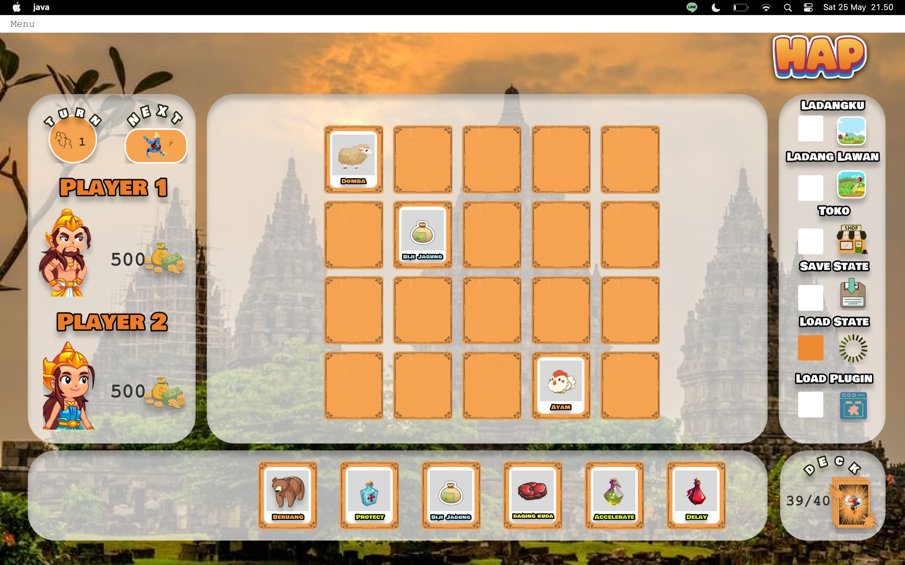

<!-- INTRO -->
<br />
<div align="center">
  <h1 align="center">Tugas Besar 2 IF2210 Pemrograman Berorientasi Objek Tahun Ajaran 2023/2024</h1>

  <p align="center">
    <h3> Kelola Kerajaan Revisi bersama Labpro </h3>
    <p>Game made using Java Language</p>
    <br />
    <a href="https://github.com/zultopia/HAP_BoloBoloBoys.git">Report Bug</a>
    ·
    <a href="https://github.com/zultopia/HAP_BoloBoloBoys.git">Request Feature</a>
<br>
<br>

[![MIT License][license-shield]][license-url]

  </p>
</div>

<!-- CONTRIBUTOR -->
<div align="center" id="contributor">
  <strong>
    <h3>Dibuat oleh Kelompok "HAP_BoloBoloBoys" :</h3>
    <table align="center">
      <tr>
        <td>NIM</td>
        <td>Nama</td>
      </tr>
      <tr>
        <td>Adam Dharma Sakti</td>
        <td>10023359</td>
     </tr>
     <tr>
        <td>Marzuli Suhada M</td>
        <td>13522070</td>
    </tr>
    <tr>
        <td>Bagas Sambega Rosyada</td>
        <td>13522071</td>
    </tr>
     <tr>
        <td>Ahmad Mudabbir Arif</td>
        <td>13522072</td>
    </tr>
    <tr>
        <td>Muhammad Naufal Aulia</td>
        <td>13522074</td>
    </tr>
    <tr>
        <td>Naufal Adnan</td>
        <td>13522116</td>
    </tr>
    </table>
  </strong>
</div>

## Table of Contents
- [Table of Contents](#table-of-contents)
- [Deskripsi Project](#deskripsi-project)
- [Deskripsi Program](#deskripsi-program)
- [Struktur Program](#struktur-program)
- [Bonus Program](#bonus)
- [Program Features](#program-features)
- [Running The Program](#running-the-program)
    - [Prerequisites](#prerequisites)
    - [How to Compile](#how-to-compile)
- [Libraries Used](#libraries-used)
- [Screenshot](#screenshot)
- [Acknowledgements](#acknowledgements)

## Deskripsi Project

Projek ini adalah sebuah Tugas Besar untuk Mata Kuliah IF2210 Pemrograman Berorientasi Objek, yaitu pembuatan sebuah
aplikasi Point of Sales (POS) dalam bahasa Java yang diperuntukkan membantu manajemen dari sebuah usaha.

## Deskripsi Program

Aplikasi simulasi kelola kerajaan yang kami buat memungkinkan dua pemain untuk bertanding dalam memanajemen ladang mereka masing-masing. Setiap pemain memiliki ladang berbentuk matriks yang dapat diisi dengan tanaman dan hewan yang mereka miliki dalam bentuk kartu. Pada setiap giliran, pemain dapat menanam tanaman, merawat hewan, memanen objek-objek tersebut, atau mempersiapkan pertahanan dari serangan beruang yang terjadi secara acak. Serangan ini dapat merusak tanaman atau hewan di ladang, mempengaruhi penghasilan pemain. 

Pemenang ditentukan setelah 20 putaran berdasarkan jumlah uang yang berhasil dikumpulkan oleh masing-masing pemain. Aplikasi ini juga menyediakan fitur save & load yang memungkinkan pengguna untuk menyimpan progress permainan mereka dan melanjutkannya di lain waktu. Aplikasi ini juga memiliki fitur untuk di-customize dengan mudah melalui plugin, sehingga pengguna dapat menambahkan format file lain untuk save & load sesuai kebutuhan mereka. Secara keseluruhan, aplikasi kami menyediakan desain antarmuka grafis yang menarik dan intuitif, sehingga pengguna dapat dengan mudah mengakses dan mengelola ladang mereka, menjadikan simulasi ini menarik dan interaktif bagi para pemainnya.
[link berikut](https://docs.google.com/document/d/12hBOBBN10KcX3LbXnmlxRflqP494hyHIPlGQOe48578/edit)
   
## Struktur Program
```
.
├── pom.xml
├── mvnw.cmd
├── mvnw
└── src/
    ├── main/
    │   ├── java/
    │   │   ├── module-info.java
    │   │   └── com.hap.hap_bolobologuys/
    │   │       ├── GameView.java
    │   │       ├── GameViewController.java
    │   │       ├── HomeView.java
    │   │       ├── HomeViewController.java
    │   │       └── lib
    │   └── resources/
    │       └── assets
    └── test
```

## Bonus 

1. Unit Testing
Implementasi unit testing dilakukan dengan menggunakan library JUnit5, Jacoco, dan Surefire untuk membuat coverage report. Unit testing yang dilakukan telah menunjukkan coverage di atas 60% untuk setiap kelas yang ada unit test. Pada coverage report di bawah ini menunjukkan bahwa untuk instructions memiliki coverage 84% dan untuk setiap percabangan (branches) memiliki coverage 74%. Untuk menjalankan unit testing pada proyek ini dapat dilakukan dengan memberikan command `mvn test` pada root directory project.


2. Memperindah UI
Pada GUI yang diimplementasikan, kami menambahkan beberapa komponen tambahan yang membuat pemain tidak merasa bosan dan merasa excited untuk memainkannya. Komponen yang kami tambahkan pertama adalah membuat page program sebanyak 3 yang terdiri dari tampilan awal saat menjalankan program atau Home dari program ini. Pada page Home kami menambahkan komponen berupa jam dan tanggal saat ini dan juga di bagian bawahnya terdapat informasi tim pembuat program yaitu kami. Lalu untuk memilih menunya berada di paling atas. Selain menu Home, terdapat menu Setting dan menu Game. Menu setting ini menampilkan informasi mengenai aplikasi program dan alur permainan dari program ini. Menu utama pada program ini adalah menu Game. Pada menu game kami membuat tampilan gambar dari background dan elemen-elemen lainnya terlihat lebih menarik. Selain itu juga kami menambahkan sound untuk menemani pemain saat bermain agar tidak terlalu sunyi. Button yang terdapat pada tampilannya juga dibuat hover agar lebih memperjelas saat pemain menggunakannya. 

## Program Features

* Catchy Home and Game Screen!
* Sound exciting!
* Settings

## Running The Program

### Prerequisites

1. Maven
2. Java 20 
3. IDE

### How to Compile

- Clone Repository

  `https://github.com/zultopia/HAP_BoloBoloBoys.git `

- Download openjfx 18

    - Download openjfx from this link
      `https://download2.gluonhq.com/openjfx/18.0.2/openjfx-18.0.2_linux-aarch64_bin-sdk.zip`

    - Extract the zip and remember the extracted path

- Compile package using maven in project root folder. This command will compile both main program and plugin files.

  `mvn package`

- Inside app/target folder run

  `
  java \
  --module-path javafx-sdk-18.0.2\lib \
  --add-exports=javafx.base/com.sun.javafx.event=org.controlsfx.controls \
  -jar app-1.0-SNAPSHOT-shaded.jar
  `

- replace javafx-sdk-18.0.2\lib with relative or absolute path to the same folder from previously extracted folder

## Libraries Used

Java Version : 20 

* OpenJFX 18
* ControlsFX 11
* Bootstrapfx
* Jackson

## Screenshot 



## Acknowledgements

Projek ini dibuat dalam rangka memenuhi keperluan tugas besar IF2210 Pemrograman Berorientasi Objek, dengan demikian,
kami berterimakasih banyak pada asisten Lab Pemrograman dan juga dosen pengampu mata kuliah atas tugas besar yang
telah diberikan.

## Licensing

The code in this project is licensed under MIT license.  
Code dalam projek ini berada di bawah lisensi MIT.

<br>
<h3 align="center"> TERIMA KASIH! </h3>

# Cara Run
Instal maven lalu ke root folder dan mvn clean javafx:run 

[license-shield]: https://img.shields.io/github/license/othneildrew/Best-README-Template.svg?style=for-the-badge
[license-url]: https://github.com/zultopia/HAP_BoloBoloBoys/blob/main/LICENSE